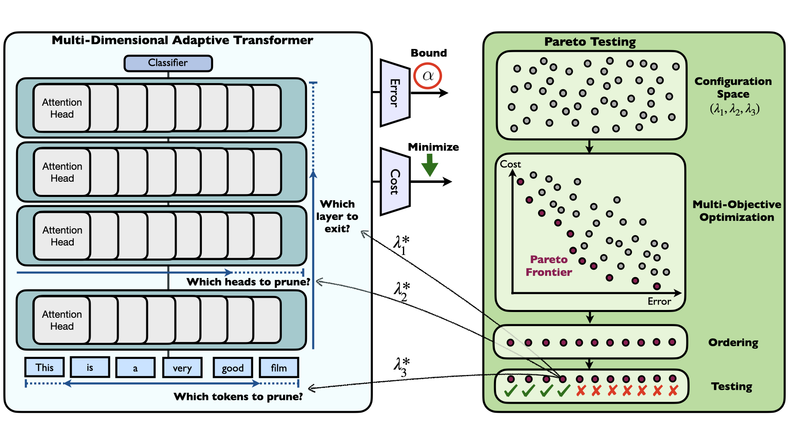

# Efficiently Controlling Multiple Risks with Pareto Testing

Code for [Efficiently Controlling Multiple Risks with Pareto Testing](https://openreview.net/pdf?id=cyg2YXn_BqF) 

## Summary

Machine learning applications frequently come with multiple diverse objectives and constraints that can change over time. Accordingly, trained models can be tuned with sets of hyper-parameters that affect their predictive behavior (e.g., their run-time efficiency versus error rate). As the number of constraints and hyper-parameter dimensions grow, naively selected settings may lead to sub-optimal and/or unreliable results. We develop an efficient method for calibrating models such that their predictions provably satisfy multiple explicit and simultaneous statistical guarantees (e.g., upper-bounded error rates), while also optimizing any number of additional, unconstrained objectives (e.g., total run-time cost). Building on recent results in distribution-free, finite-sample risk control for general losses, we propose Pareto Testing: a two-stage process which combines multi-objective optimization with multiple hypothesis testing. The optimization stage constructs a set of promising combinations on the Pareto frontier. We then apply statistical testing to this frontier only to identify configurations that have (i) high utility with respect to our objectives, and (ii) guaranteed risk levels with respect to our constraints, with specifiably high probability. We demonstrate the effectiveness of our approach to reliably accelerate the execution of large-scale Transformer models in natural language processing (NLP) applications. In particular, we show how Pareto Testing can be used to dynamically configure multiple inter-dependent model attributes—including the number of layers computed before exiting, number of attention heads pruned, or number of text tokens considered—to simultaneously control and optimize various accuracy and cost metrics.


### Prerequisites

* pytorch
* transformers
* numpy 
* pandas
* seaborn
* scipy
* captum
* tqdm

### Usage

1. Dowload AG News/IMDB dataset into data/ag or data/imdb folder
2. Process data:
```sh
sh process_data.sh TASK
```
3. Train multi-dimensional adaptive transformer:
```sh
sh adaptive_pruning.sh TASK
```
4. Calibration:
```sh
sh calibration.sh TASK
```
TASK = {ag, imdb}


### Citation
If you use this in your work please cite:
```bibtex
@inproceedings{laufer2023efficiently,
    title={Efficiently Controlling Multiple Risks with Pareto Testing},
    author={Bracha Laufer-Goldshtein and Adam Fisch and Regina Barzilay and Tommi Jaakkola},
    booktitle={Proceedings of The Eleventh International Conference on Learning Representations},
    year={2023},
}
